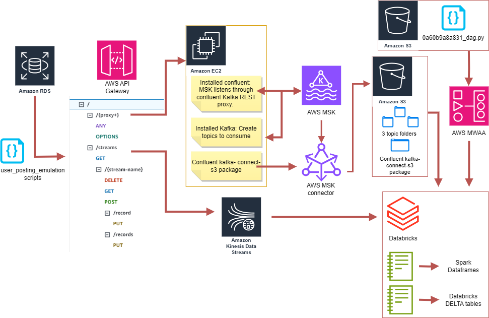

# Pinterest Data Pipeline

[Pinterest](https://newsroom.pinterest.com/en-gb/company/) is a visual discovery engine designed to provide ideas and inspiration. As each user interacts through viewing posts, following or uploading, Pinterest crunches billions of data points every day to decide how to provide more value to their users. 

This project aims to design an end-to-end pipeline utilising AWS cloud technologies and Databricks for analysing real-time and historical pinterest-emulated data.

## Table of Contents

####  [Installation and usage instructions](#-installation-and-usage-instructions-1)    
#### &nbsp;&nbsp;&nbsp;&nbsp;&nbsp;&nbsp;&nbsp;&nbsp;  &nbsp;&nbsp;&nbsp;&nbsp;[Installation](#installation)    
#### &nbsp;&nbsp;&nbsp;&nbsp;&nbsp;&nbsp;&nbsp;&nbsp;  &nbsp;&nbsp;&nbsp;&nbsp;[Tools and dependencies](#tools-and-dependencies)      
####  [Pipeline architecture](#pipeline-architecture)
####  [File structure of the project](#-file-structure-of-the-project-1)
####  [Data](#-data-1)
####  [The Pipeline Build](#-the-pipeline-build-1)
#### &nbsp;&nbsp;&nbsp;&nbsp;&nbsp;&nbsp;&nbsp;&nbsp;  &nbsp;&nbsp;&nbsp;&nbsp;[Setting up project environment](#1-setting-up-project-environment)
#### &nbsp;&nbsp;&nbsp;&nbsp;&nbsp;&nbsp;&nbsp;&nbsp;  &nbsp;&nbsp;&nbsp;&nbsp;[Exploring the Pinterest emulation data](#2-exploring-the-pinterest-emulation-data)
#### &nbsp;&nbsp;&nbsp;&nbsp;&nbsp;&nbsp;&nbsp;&nbsp;  &nbsp;&nbsp;&nbsp;&nbsp;[Batch processing: Configuring EC2 Kafka client](#3-batch-processing-configuring-ec2-kafka-client)
#### &nbsp;&nbsp;&nbsp;&nbsp;&nbsp;&nbsp;&nbsp;&nbsp;  &nbsp;&nbsp;&nbsp;&nbsp;[Connect MSK cluster to an S3 bucket](#4-connect-msk-cluster-to-an-s3-bucket)
#### &nbsp;&nbsp;&nbsp;&nbsp;&nbsp;&nbsp;&nbsp;&nbsp;  &nbsp;&nbsp;&nbsp;&nbsp;[Configuring API in API gateway](#5-configuring-api-in-api-gateway)
#### &nbsp;&nbsp;&nbsp;&nbsp;&nbsp;&nbsp;&nbsp;&nbsp;  &nbsp;&nbsp;&nbsp;&nbsp;[Mount AWS S3 bucket onto Databricks](#6-mount-aws-s3-bucket-onto-databricks)
#### &nbsp;&nbsp;&nbsp;&nbsp;&nbsp;&nbsp;&nbsp;&nbsp;  &nbsp;&nbsp;&nbsp;&nbsp;[Clean and query the data on databricks](#7-clean-and-query-the-data-on-databricks)
#### &nbsp;&nbsp;&nbsp;&nbsp;&nbsp;&nbsp;&nbsp;&nbsp;  &nbsp;&nbsp;&nbsp;&nbsp;[Batch processing: AWS MWAA](#8-batch-processing-aws-mwaa) 
#### &nbsp;&nbsp;&nbsp;&nbsp;&nbsp;&nbsp;&nbsp;&nbsp;  &nbsp;&nbsp;&nbsp;&nbsp;[Stream Processing: AWS Kinesis](#9-stream-processing-aws-kinesis)
####  [License information](#license-information)

## 📦 Installation and usage instructions
   
### Installation    
     
This project was run in a conda environment on Linux Ubuntu 22.04.3 LTS (Jammy Jellyfish). 

[Miniconda](https://docs.conda.io/en/latest/miniconda.html) (recommended) or [Anaconda](https://www.anaconda.com/products/distribution) can be downloded depending on your operating system. 

For conda environment dependencies the `pinterest_conda_env.yml` can be cloned to recreate the environment.

    conda env create -f pinterest_conda_env.yml
    conda activate pinterest_conda_env

For those not utilising a conda environment, this project depends on the following modules: 
- `pymysql`
- `requests`
- `sqlalchemy`

   
**Note:** Due to confidential information for AWS and Databricks account access, this project cannot be run by others directly, however can function as a step by step guide on replicating the pipeline.  

### Tools and dependencies

- **Apache Kafka :**  
 Apache kafka is an unified event streaming platform for handling all real-time data feeds (for example, Internet of Thing sensors and smartphones). It combines messaging, storage, and stream processing to allow storage and analysis of both historical and real-time data. The documention can be found [here](https://kafka.apache.org/documentation/). 

- **AWS MSK :**  
Amazon Managed Streaming for Apache Kafka (MSK) is a fully managed service that enables you to build and run applications that use Apache Kafka to process streaming data. The guide can be found [here](https://docs.aws.amazon.com/msk/latest/developerguide/what-is-msk.html).

- **AWS MSK Connect :**  
MSK connect is a feature of Amazon MSK, that makes it easy for developers to stream data to and from their Apache Kafka clusters. It uses the Kafka Connect framework for connecting Apache Kafka clusters with external systems such as databases, search indexes, and file systems. The guide can be found [here](https://docs.aws.amazon.com/msk/latest/developerguide/msk-connect-getting-started.html).

- **Kafka REST Proxy :**  
The Confluent REST Proxy provides a RESTful interface to an Apache Kafka® cluster, making it easy to produce and consume messages, view the state of the cluster, and perform administrative actions without using the native Kafka protocol or clients. The guide can be found [here](https://docs.confluent.io/platform/current/kafka-rest/index.html).

- **AWS API Gateway :**  
Amazon API Gateway is a fully managed service for creating, publishing, maintaining, monitoring, and securing APIs at any scale. APIs act as the "front door" for applications to access data, business logic, or functionality from your backend services. The documentation can be found [here](https://docs.aws.amazon.com/apigateway/)

- **Apache Spark :**  
Apache Spark is a unified analytics engine for large-scale data processing. It provides high-level APIs in multiple languages and an optimized engine that supports general execution graphs.
It also contains higher-level tools including Spark SQL, pandas API on Spark, MLib, GraphX, and Structure Streaming. All documentation can be found [here](https://spark.apache.org/documentation.html) 

- **PySpark :**  
PySpark is the Python API for Apache Spark, used to process data with Spark in Python. It supports all of the features mentioned in Apache Spark. [here](https://spark.apache.org/docs/latest/api/python/index.html)

- **AWS MWAA :**  
Amazon Managed Workflows for Apache Airflow (MWAA) is a managed orchestration service for Apache Airflow that sets up and operates data pipelines in the cloud at scale. programmatically author, schedule, and monitor sequences of processes and tasks referred to as workflows.
[here](https://docs.aws.amazon.com/mwaa/latest/userguide/what-is-mwaa.html)

- **AWS Kinesis :**  
Amazon Kinesis is used to capture, process, and store video and data streams in real-time for analytics and machine learning. The documentation can be found [here](https://docs.aws.amazon.com/kinesis/)

- **Databricks :**  
The Databricks Lakehouse platform can be used for building, deploying, sharing, and maintaining enterprise-grade data, analytics, and AI solutions at scale. It performs Spark processing of batch and streaming data. The documentation can be found [here](https://docs.databricks.com/en/index.html)

- **AWS EC2 :**  
Amazon Elastic Compute Cloud (Amazon EC2) provides on-demand, scalable computing capacity in the Amazon Web Services (AWS) Cloud. It can launch virtual servers, configure security and networking, and manage storage. The documentation can be found [here](https://docs.aws.amazon.com/ec2/)

- **AWS RDS :**  
Amazon Relational Database Service is a web service that makes it easier to set up, operate, and scale a relational database in the AWS Cloud. The documentation can be found [here](https://docs.aws.amazon.com/rds/)

[Back to top](#pinterest-data-pipeline)

 

## 💡Pipeline architecture

[Back to top](#pinterest-data-pipeline)

## 📂 File structure of the project

1. **project_log.ipynb:** Contains a journey log of all steps taken.
2. **user_posting_emulation.py:** A script which emulates the stream of POST requests by users on Pinterest.   
    - AWSDBConnector (class): Connects to an AWS RDS database  
        - create_db_connector (method):  Creates and returns a SQLAlchemy engine for the database connection. 
    - map_select_row (function):  Select a random row from the specified table in the database
    - convert_datetime (function):  Convert datetime values in the dictionary to formatted strings.
    - run_infinite_post_data_loop (Wrapper):  Decorator function for running an infinite loop to post data.
    - api_send_to_kafka (function):  Send data to Kafka using the specified API.
    - api_send_to_kinesis (function):  Send data to Kinesis using the specified API.
3. **user_posting_emulation_batch.py:** A script to post user, geo, and pin data to Kafka.
    - kafka_post (function):  Calls api_send_to_kafka. Posts data to Kafka topics using the specified API endpoints.
4. **user_posting_emulation_streaming.py:** A script to post user, geo, and pin data to Kinesis.
    - kinesis_stream_post (function):  Calls api_send_to_kinesis function. Posts data to Kinesis streams using the specified API endpoints.
5. **pinterest_authenticate_aws.ipynb:** Databricks notebook to retrieve authentication keys 
    - authentication (function):  Reads delta table and extracts AWS authentication keys. 
6. **mount_s3_bucket.ipynb:** Databricks notebook to mount s3 bucket, 

7. **cleaning_utils.ipynb:** Databricks notebook housing three dataframe cleaning functions.
    - clean_df_pin (function): Cleans df_pin dataframe and returns cleaned dataframe.
    - clean_df_geo (function): Cleans df_geo dataframe and returns cleaned dataframe.
    - clean_df_user (function): Cleans df_user dataframe and returns cleaned dataframe.

6. **pinterest_batch_data.ipynb:** Uses the authenticate function, reads data from the mounted s3 bucket, utilises clean_data function, and houses all batch data queries.

7. **pinterest_streaming_data.ipynb:** Uses the authenticate function, reads kinesis streams, utilises clean_data function, and writes cleaned data to Delta tables.
    - read_kinesis_stream (function): Read and deserialise the streaming data from Kinesis
    - store_as_delta (function): Writing the streams to Databricks Delta tables.
 

[Back to top](#pinterest-data-pipeline)

## 📄 Data 

Infrastructure similar to what is found if data engineer working at Pinterest. 

user_posting_emulation.py, that contains the login credentials for a RDS database, which contains three tables with data resembling data received by the Pinterest API when a POST request is made by a user uploading data to Pinterest:

### **pinterest_data :** contains data about posts being updated to Pinterest
    
> Example data:

    {'index': 7528, 'unique_id': 'fbe53c66-3442-4773-b19e-d3ec6f54dddf', 'title': 'No Title Data Available', 'description': 'No description available Story format', 'poster_name': 'User Info Error', 'follower_count': 'User Info Error', 'tag_list': 'N,o, ,T,a,g,s, ,A,v,a,i,l,a,b,l,e', 'is_image_or_video': 'multi-video(story page format)', 'image_src': 'Image src error.', 'downloaded': 0, 'save_location': 'Local save in /data/mens-fashion', 'category': 'mens-fashion'}

### **geolocation_data :** contains data about the geolocation of each Pinterest post

> Example data:

    {'ind': 7528, 'timestamp': datetime.datetime(2020, 8, 28, 3, 52, 47), 'latitude': -89.9787, 'longitude': -173.293, 'country': 'Albania'}

### **user_data contains :** data about the user that has uploaded each Pinterest post

> Example data:

    {'ind': 7528, 'first_name': 'Abigail', 'last_name': 'Ali', 'age': 20, 'date_joined': datetime.datetime(2015, 10, 24, 11, 23, 51)}

[Back to top](#pinterest-data-pipeline)

## 🛠 The pipeline build  

#### The pipeline can be sectioned into Pinterest emulations, batch processing and stream processing. Details of steps taken can be found in the `project_log.ipynb`file. 

### 1. Setting up project environment

Create a conda environment and install required libraries.

### 2. Exploring the Pinterest emulation data. 
As shown under the [Data](#-data-1) section. 

### 3. Batch processing: Configuring EC2 Kafka client

Create an MSK cluster, and connect it to an established EC2 instance which will act as an Apache Kafka client.
The EC2 client has Kafka, Java and IAM MSK authentication packages installed which allows for the authentication and connection of the EC2 to the MSK cluster. Using the EC2 client, three Kafka topics can now be created.    

### 4. Batch processing: Connect MSK cluster to an S3 bucket
Next, configure MSK Connect to enable the MSK cluster to automatically transmit and store data to an S3 bucket, that is partitioned by topic. This is achieved by downloading the Confluent.io Amazon S3 Connector and adding it to the S3 bucket through the EC2 client, on the other hand creating a connector in MSK connect by using a custom plugin (which is designed to connect to the S3 bucket).

### 5. Batch processing: Configuring API in API gateway

Construct a REST API within the API gateway with the EC2 network as the endpoint. Then on the EC2 client side, install the Confluent package to listen for requests, which allows the REST proxy API to interact with the Kafka cluster and thus the MSK cluster.

Update the `user_posting_emulation.py` script, to add a function which posts data messages to the cluster via the API gateway and the Kafka REST proxy. Building upon this script, construct a second script `user_posting_emulation_batch.py` to send messages to the EC2 client through three endpoints (one for each topic), consequently sending it to the MSK cluster which is connected to the three topics inside the S3 bucket. 

### 6. Batch processing: Mount AWS S3 bucket onto Databricks

In order to clean and query the batch data, mounting the S3 bucket on Databricks is required. Therefore, a notebook `pinterest_autenticate_aws` was created to read and extract the delta table containg the AWS keys to Databricks sparks dataframe, 
and another notebook 'mount_S3_bucket was created to house a mounting function to mount the S3 bucket to Databricks. 
The third notebook `pinterest_batch_data` reads the json data from the s3 bucket topics and creates three Spark dataframes, one for each topic (user, pin, and geo).

### 7. Batch processing: Clean and query the data on databricks: 

Clean the three dataframes df_pin, df_geo, df_user and query the data on databricks using pyspark. Detailed steps on the cleaning function can be found in `cleaning_utils` notebook. THe cleaning function is run inside the `piterest_batch_data` notebook, it also houses code on the queries.

#### Queries were as follows:

1. Find the most popular Pinterest category people post to based on their country.
2. Find the most popular category in each year between 2018 and 2022
3. Find the user with most followers in each country
4. What is the most popular category people post to for different age groups?
5. What is the median follower count for users in different age groups?
6. Find how many users have joined each year between 2015 and 2020
7. Find the median follower count of users based on their joining year between 2015 and 2020.
8. Find the median follower count of users based on their joining year and age group for 2015 to 2020.

### 8. Batch processing: AWS MWAA 

Orchestrate Databricks workloads on AWS MWAA by uploading `0a60b9a8a831_dag.py`, a Directed Acyclic Graph (DAG) to an AWS MWAA environment via its associated S3 bucket, `mwaa-dags-bucket/dags`. This initiates @daily execution.

### 9. Stream processing: AWS Kinesis

Moving on to processing streaming data. Three data streams can be created on AWS Kinesis, one for each of the tables pin, user, and geo. Modify the previously created REST API to invoke Kinesis actions to 
1. List steams in Kinesis 
2. Create, describe and delete streams in Kinesis 
3. Append records to Kinesis    

To send requests to this REST API, the `user_posting_emulation.py` script was modified to include an api_send_to_kinesis function and a `user_posting_emulation_streaming.py` script to send messages to Kinesis through three endpoints (one for each topic), 
this adds one record at a time to the corresponding Kinesis streams.
Using the notebook `pinterest_steaming_data`, this data can then be read inside Databricks, cleaned and converted into Delta tables for a live overview.  

[Back to top](#pinterest-data-pipeline)

## Looking forward

1. To enhance scalability, the pinterest_batch_data notebook currently experiences extended run-time. A potential improvement involves optimizing performance by transforming the existing dataframes into Delta tables.
2. Following the completion of the final Databricks conversions, exploring the data through industry-standard visualization tools like Power BI or Tableau can enhance the overall analytical insights.

[Back to top](#pinterest-data-pipeline)

## License information
GNU General Public License (GPL) v3.0

[Back to top](#pinterest-data-pipeline)

